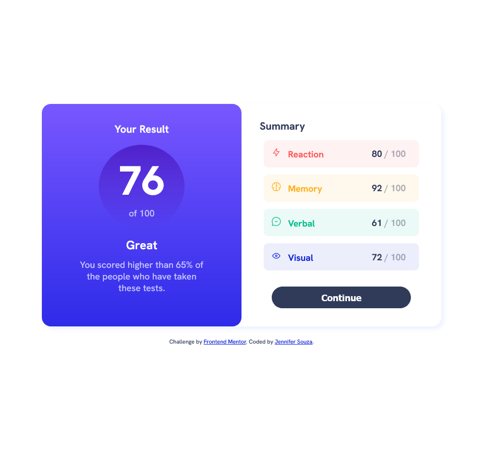

# Frontend Mentor - Results summary component solution

This is a solution to the [Results summary component challenge on Frontend Mentor](https://www.frontendmentor.io/challenges/results-summary-component-CE_K6s0maV). Frontend Mentor challenges help you improve your coding skills by building realistic projects.

## Table of contents

- [Overview](#overview)
  - [The challenge](#the-challenge)
  - [Screenshot](#screenshot)
  - [Links](#links)
- [My process](#my-process)
  - [Built with](#built-with)
  - [What I learned](#what-i-learned)
  - [Continued development](#continued-development)
  - [Useful resources](#useful-resources)
- [Author](#author)

## Overview

### The challenge

Users should be able to:

- View the optimal layout for the interface depending on their device's screen size
- See hover and focus states for all interactive elements on the page
- **Bonus**: Use the local JSON data to dynamically populate the content

### Screenshot

### Links

- Solution URL: [https://github.com/zoedarkweather/results-summary-component](https://github.com/zoedarkweather/results-summary-component)
- Live Site URL: [https://results-summary-component-zoedarkweather.vercel.app](https://results-summary-component-zoedarkweather.vercel.app/)

## My process

### Built with

- Semantic HTML5 markup
- CSS custom properties (for color readability)
- CSS Grid
- Mobile-first workflow
- Javascript

### What I learned

I learned how to select individual table rows using nth-child. I got some practice using fetch, async functions and promises. I learned that I needed to run a dev server to access a local JSON file without getting a CORS error, and that led me to learn that there is a handy VSCOde extension for that called Live Server. Life changing info.

### Continued development

I'd like to learn more best-practices for organizing stylesheets. I keep trying different things, but I'd like to know what the best-practices or conventions are for that and also for class names.

### Useful resources

- [MDN - Styling Tables](https://developer.mozilla.org/en-US/docs/Learn/CSS/Building_blocks/Styling_tables) 
- [MDN - Async and Await](https://developer.mozilla.org/en-US/docs/Learn/JavaScript/Asynchronous/Promises#async_and_await) 

## Author

- Github - [Jennifer Souza](https://github.com/zoedarkweather)
- Frontend Mentor - [@zoedarkweather](https://www.frontendmentor.io/profile/zoedarkweather)
